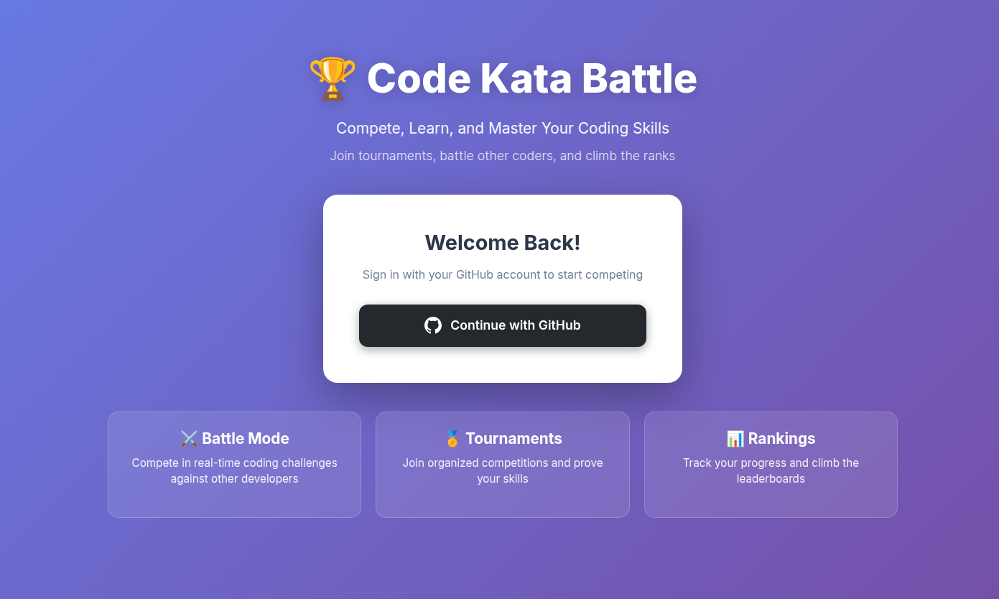
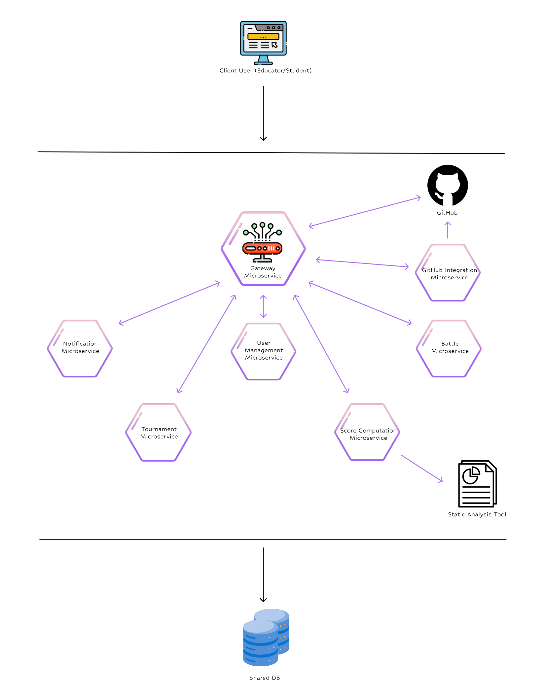

# 🏆 Code Kata Battle

<div align="center">


### A modern platform for competitive programming tournaments and coding challenges

*Compete, Learn, and Master Your Coding Skills* 🚀

[](https://openjdk.java.net/) [](https://spring.io/projects/spring-boot) [](LICENSE)




</div>

---

## 🎯 What is Code Kata Battle?

Code Kata Battle is a comprehensive microservices-based platform designed to facilitate competitive programming tournaments in educational settings. It enables educators to create coding challenges, students to participate in battles, and automated evaluation of submissions through GitHub integration.

---

## 🌊 Waterfall Development

This project was developed using a **waterfall software development approach** by a team of three students as part of the Software Engineering 2 course at Politecnico di Milano.

The development process followed traditional waterfall phases, with comprehensive documentation produced at each stage. All project artifacts are available in the `docs/` folder:

### 📋 Documentation

| Document | Description |
|----------|-------------|
| **Original Requirements** ([`docs/initial-requirements/`](docs/initial-requirements/)) | Stakeholder requirements and initial project assignments provided by the course instructors |
| **Requirements Analysis Document** ([PDF](docs/produced-analysis/Requirements_analysis_document.pdf)) | Detailed analysis of functional and non-functional requirements, use cases, UML diagrams, scenarios, and domain modeling |
| **Design Document** ([PDF](docs/produced-analysis/Design_document.pdf)) | System architecture design, microservices breakdown, component diagrams, database schema, API specifications, and design patterns applied |
| **Implementation & Testing Document** ([PDF](docs/produced-analysis/Implementation_and_testing_document.pdf)) | Implementation details, code structure, testing strategies, unit tests, integration tests |
| **Acceptance Testing Document** ([PDF](docs/produced-analysis/Acceptance_testing_document.pdf)) | Acceptance testing results on a similar project from another team. |
| **Final Presentation** ([PPTX](docs/produced-analysis/Final_presentation.pptx)) | Project overview, architecture walkthrough, demo scenarios, and key achievements |

### 🔧 Formal Verification

The project also includes an **Alloy formal model** ([`docs/alloy_model.als`](docs/alloy_model.als)) used to verify critical system properties and validate the correctness of the tournament and battle management logic.

---

## 🏗️ Architecture

This project follows a **microservices architecture** with clear separation of concerns:

<div align="center">





</div>


### Microservices

| Service | Port | Purpose |
|---------|------|---------|
| **Gateway** | 8087 | API gateway, OAuth2 authentication, frontend serving |
| **User** | 8086 | User management and authentication |
| **Tournament** | 8085 | Tournament lifecycle management |
| **Battle** | 8083 | Coding battle management |
| **GitHub Integration** | 8090 | GitHub API integration for code retrieval |
| **Score Computation** | 8089 | SonarQube integration for code quality scoring |
| **Notification** | 8088 | Event processing and real-time notifications |

---

## 💻 Technology Stack

### Backend
- ☕ **Java 17** - Modern Java with enhanced features
- 🍃 **Spring Boot 2.7/3.2** - Microservices framework
- 🔐 **Spring Security OAuth2** - GitHub authentication
- 🗄️ **PostgreSQL** - Relational database
- 📨 **Apache Kafka** - Event streaming platform
- 🎨 **Thymeleaf** - Server-side template engine

### Frontend
- 🎭 **Thymeleaf Templates** - Dynamic HTML rendering
- 🎨 **Bootstrap 5** - Responsive UI framework

### Infrastructure
- 🐳 **Docker Compose** - Container orchestration
- 🛠️ **Maven** - Build automation and dependency management
- 📊 **SonarQube** - Code quality analysis
- 🐙 **GitHub API** - Source code integration

---

## 🚀 Quick Start

### Prerequisites

- ☕ Java 17 or higher
- 🔨 Maven 3.8+
- 🐳 Docker & Docker Compose
- 🐙 GitHub OAuth App ([Create one here](https://github.com/settings/developers))

### 1. Clone the Repository

```bash
git clone https://github.com/matteosissa/CodeKataBattleProject.git
cd CodeKataBattleProject
```

### 2. Configure GitHub OAuth

Update `codekatabattle-source/gateway_microservice/src/main/resources/application.yml`:

```yaml
spring:
  security:
    oauth2:
      client:
        registration:
          github:
            client-id: YOUR_GITHUB_CLIENT_ID
            client-secret: YOUR_GITHUB_CLIENT_SECRET
```

Or use the provided default credentials for quick testing (development only).

### 3. Start Infrastructure

```bash
docker-compose up -d
```

This starts:

- 🐘 PostgreSQL on port 5432
- 📨 Kafka on port 9092
- 🦁 Zookeeper on port 2181

### 4. Build the Application

```bash
./build-delivery.sh
```

This script:

- ✅ Compiles all 7 microservices
- 📦 Packages them into executable JARs
- 📁 Creates the `delivery-ckb` folder with run scripts

### 5. Run the Application

```bash
cd delivery-ckb
./bin/runCKB.sh
```

Wait for all services to start (approximately 30-60 seconds).

### 6. Access the Platform

Open your browser and navigate to:

```
http://localhost:8087
```

🎉 **You're ready to compete!**

---

## 📖 Usage

### For Educators 👨‍🏫

1. **Login** with your GitHub account
2. **Create a Tournament**
   - Click "Create a new tournament"
   - Set registration and submission deadlines
   - Add tournament description
3. **Create Battles** within the tournament
   - Link GitHub repository with test cases
   - Configure team size and deadlines
4. **Monitor Progress**
   - View student submissions
   - Track scores and rankings
   - End tournaments when complete

### For Students 👨‍🎓

1. **Login** with your GitHub account
2. **Browse Tournaments**
   - Click "Display all tournaments"
   - View available tournaments with deadlines
3. **Subscribe to Tournaments**
   - Select a tournament
   - Join battles within tournaments
   - Form teams with other students
4. **Compete**
   - Submit code via GitHub
   - View real-time scores
   - Check your ranking
5. **Receive Notifications**
   - Click the "Notifications" button
   - Get updates on scores and rankings


---

## 🔧 Development

### Project Structure

```
CodeKataBattleProject/
├── codekatabattle-source/          # Source code
│   ├── gateway_microservice/       # Gateway & Frontend
│   ├── user_microservice/          # User management
│   ├── tournament_microservice/    # Tournament logic
│   ├── battle_microservice/        # Battle management
│   ├── github_integration_microservice/
│   ├── score_computation_microservice/
│   └── notification_microservice/
├── docs/                           # Documentation and screenshots
├── docker-compose.yml              # Infrastructure setup
├── build-delivery.sh               # Build automation script
└── delivery-ckb/                   # Compiled artifacts (gitignored)
    ├── bin/
    │   ├── runCKB.sh              # Start all services
    │   └── stopCKB.sh             # Stop all services
    └── [microservice-name]/        # Individual JARs
```

### Building Individual Microservices

```bash
cd codekatabattle-source/[microservice-name]
mvn clean package
```

### Running Individual Services

```bash
java -jar target/[microservice-name]-0.0.1-SNAPSHOT.jar
```

### Stopping Services

```bash
cd delivery-ckb
./bin/stopCKB.sh
```

## 📄 License

This project was developed as part of a Software Engineering course project at Politecnico di Milano.
